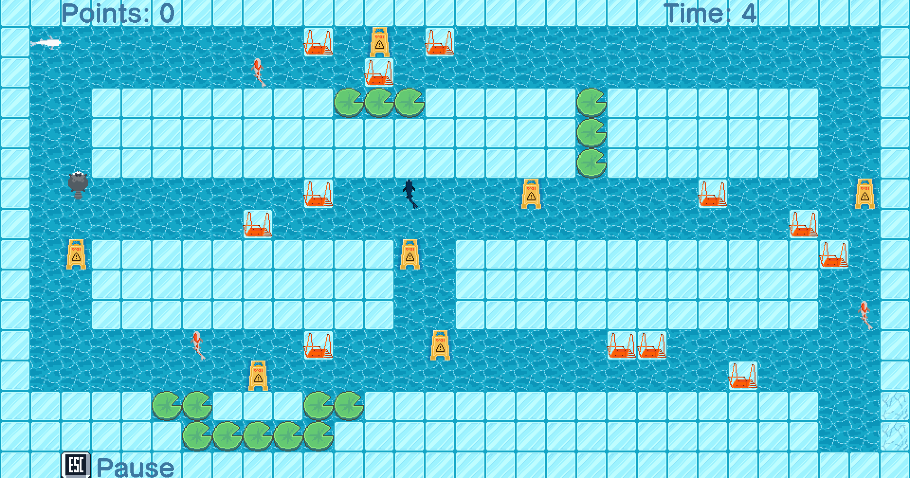

# Koi Kapers Maze Game 🐟



<p align="center"><em>Snapshot of Koi Kapers gameplay</em></p>

## Overview

*Koi Kapers Maze Game* is a Java-based maze game built using Maven and targeting Oracle JDK 21 or higher. It features an engaging design, various tests, and comprehensive JavaDocs.

## Project Structure

- **Design/** – Contains design documents including use cases, UML diagrams, and UI mockups.
- **Documents/** – Contains project reports and code review documents.
- **my-app/**  
  - **pom.xml** – Maven build configuration.  
  - **src/**  
    - **main/** – Application source code.
    - **test/** – Unit test cases.
- **target/** – Maven build output including the JAR file and JavaDocs.
- **gameplay.png** – Screenshot of the gameplay.
- **LICENSE** – Project license.
- **README.md** – This file.

## Getting Started

Follow these instructions to get a local copy of the project running on your machine.

### Prerequisites

- Maven
- JAR
- Oracle JDK 21 or higher

### Building the Game

To generate the JAR artifact, run the following command from the root folder `Koi-Kapers` of the project.

  ```sh
  mvn jar:jar -f [pom.xml](http://vscodecontentref_/1)
  ```

### Running the Application

You can run the hgame using either of the two methods: 

1. From the terminal: 

```sh
java -jar my-app/target/koi-kapers-1.0-SNAPSHOT.jar
```

2. From your IDE: 
- Open [Main.java](my-app/src/main/java/com/mycompany/app/Main.java) and click the run button.


## Running Tests

To run the tests in your IDE: 
  - Open any test class from the [my-app/src/test](my-app/src/test) directory and click the run button.

## Technologies Used

- Java 21+
- Maven 
- JAR
- Oracle JDK

## Additional Resources

- **Design Documents**: Refer to the files in the [Design/](Design) directory for UML diagrams, use cases, and UI mockups. 
- **Project Reports & Reviews:** See the [Documents/](Documents) folder for code reviews and formal reports. 
- **JavaDocs:** To generate the API documentation, navigate to [my-app](my-app) and run:
  
  ```sh 
  mvn javadoc:javadoc
  ```
  
Then view the generated documentation in [my-app/target/site/apidocs/index.html](my-app/target/site/apidocs/index.html).
- **Game Demo:** Check out the [game demo video](https://youtu.be/cZQ1i3oe57I)!

## License

This project is licensed under the MIT License – see the [LICENSE](LICENSE) file for details.
